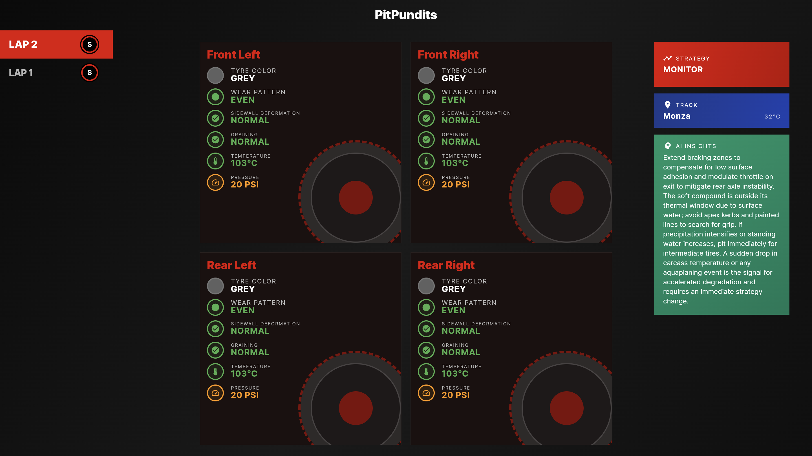

# Overview

PitPundits is a sophisticated tire analysis dashboard that visualizes critical tire data including compound types, wear patterns, temperature readings, and pressure measurements. The application features a modern dark theme with F1-inspired styling and provides detailed analytics for each tire position on the vehicle.



## Technology Stack

- **Frontend**: Flutter
- **Backend**: Firebase Firestore
- **UI Framework**: Material Design 3
- **Typography**: Google Fonts (Inter)
- **Deployment**: Firebase Hosting

## Live Application

The application is deployed and accessible at: [https://hotwheels-ea3df.web.app/](https://hotwheels-ea3df.web.app/)

## Installation

1. Clone the repository:

```bash
git clone <repository-url>
cd f1_analyzer
```

2. Install dependencies:

```bash
flutter pub get
```

3. Configure Firebase:
   - Ensure Firebase project is properly configured
   - Update `firebase_options.dart` with your project credentials

4. Run the application:

```bash
flutter run
```
